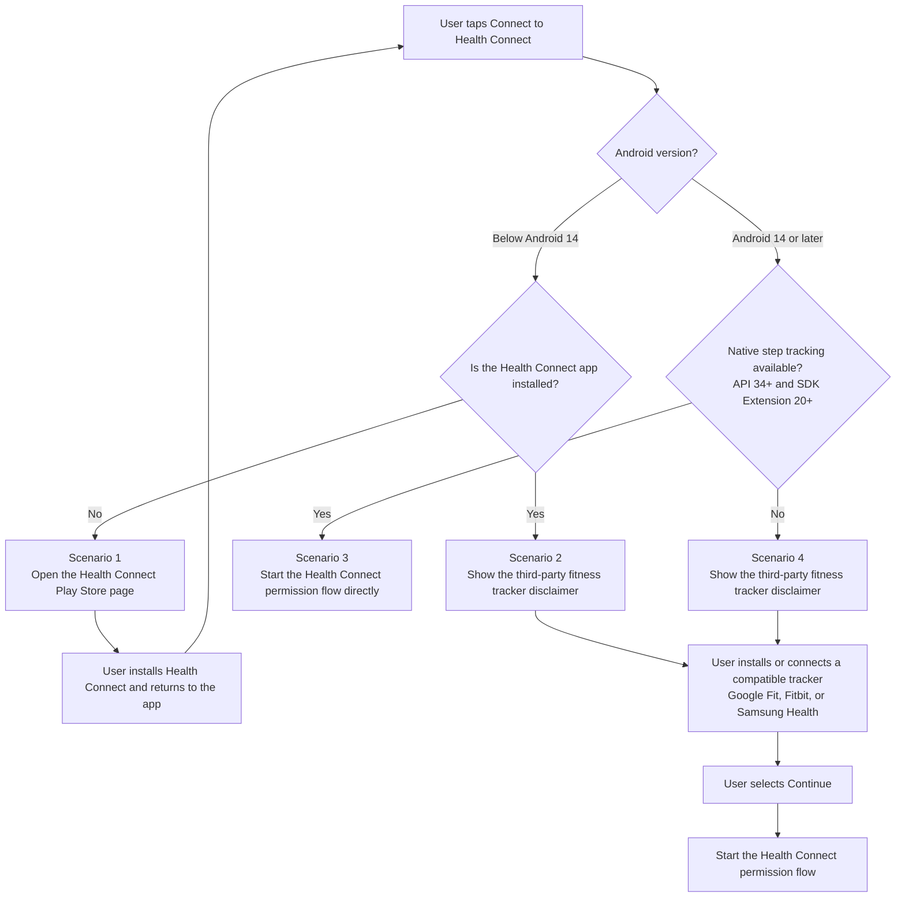

### **Instructions for configuring your Android Project**

* Install Visit React Native Plugin   
  `npm install react-native-visit-rn-sdk@3.0.9`
* Install these transitive plugins that Visit Plugin requires internally:   
  `npm install react-native-device-info`   
  `npm install https://github.com/sashko9807/react-native-location-enabler`  
  `npm install react-native-event-listeners`   
  `npm install react-native-webview`
* Enable code desugaring in your app, or there add the dependency. 

```
coreLibraryDesugaring 'com.android.tools:desugar_jdk_libs:2.1.5'
```

* Inside the `:app` `build.gradle` android block specify these. 

```

android {
	compileOptions {
		coreLibraryDesugaringEnabled true
        sourceCompatibility JavaVersion.VERSION_17
		targetCompatibility JavaVersion.VERSION_17
	}    
}
```

* In the `AndroidManifest.xml` file, add the metadata tag to serve the privacy manifest URL

    ```
     <meta-data
                android:name="visit_android_sdk.health_connect_privacy_policy_url"
                android:value="https://www.google.com" />
    ```
* Version Requirement:  
  AGP: `8.13.2` or higher  
  Kotlin: `1.9.25`or higher  
  `compileSdkVersion`: 36 or higher  

‌

### **Instructions for configuring Plugin in iOS project** 

* Add the plugin `npm install react-native-visit-rn-sdk@3.0.9 && npx pod-install`
* Install pods(for M1 processors running build on `x86_64` hardware)

    `arch -x86_64 pod install`


* In the Signing & Capabilities section in Xcode, add HealthKit as a capability
* Add these keys inside `info.plist` file

```
<key>NSHealthShareUsageDescription</key>
<string>Visit requires your permission to read health and fitness data.</string>
<key>NSHealthUpdateUsageDescription</key>
<string>Visit requires your permission to store health and fitness data in HealthKit.</string>
```

# **Usage**

```
import React from 'react';
import VisitRnSdkView from 'react-native-visit-rn-sdk';
import {EventRegister} from 'react-native-event-listeners';
import {SafeAreaView, Alert} from 'react-native';

function App() {

  return (
    <SafeAreaView style={{flex: 1}}>
      <VisitRnSdkView
        magicLink={<Enter the sso link here>}
        isLoggingEnabled={true}
        }
      />
    </SafeAreaView>
  );
}

export default App;
```

To see the full usage code for getting Health Connect/HealthKit connection status and retrieving health data, refer [here](https://github.com/VisitApp/Visit-ReactNative/blob/mchi-rn-sdk-3x/example/App.js).

## **Health Connect Connection Flow (Android)**

Version `3.0.9` uses AndroidSDK `v3.11` and routes the PWA's Health Connect request according to the Health Connect installation status and the device's native step-tracking capability.

The maintained RN 3.x release is also available through its npm dist-tag:

```bash
npm install react-native-visit-rn-sdk@rn3
```

Native step tracking is available only when both of these requirements are met:

* Android 14/API 34 or later.
* SDK Extension version 20 or later.

When native step tracking is unavailable, the PWA should explain that the user needs a compatible third-party fitness tracker app to write step data to Health Connect. The educational modal is implemented by the PWA, not by the React Native SDK.

The following chart summarizes the four supported user journeys. The scenario numbers can also be used to identify the corresponding demonstration videos.



### **Routing Behavior**

| Condition | SDK behavior | Show the PWA disclaimer |
| --- | --- | --- |
| `disclaimerAccepted === true` | Start the existing Health Connect permission flow immediately. | No |
| Health Connect status check fails | Report the error and start the existing permission flow. | No |
| Health Connect status is `NOT_INSTALLED` | Start the existing native flow, which opens the Health Connect Play Store page. | No |
| Health Connect is available and native step tracking is supported | Start the permission flow immediately. | No |
| Health Connect is available and native step tracking is unsupported | Invoke `window.showHealthConnectDisclaimer()`. | Yes |
| Native step capability check fails | Treat native step tracking as unavailable and invoke the disclaimer callback. | Yes |

Every `CONNECT_TO_GOOGLE_FIT` message is processed. There is no in-flight request guard, so after returning from the Play Store the PWA can send the message again to restart the flow.

### **PWA Contract**

On the initial **Connect to Health Connect** action, send:

```javascript
window.ReactNativeWebView.postMessage(
  JSON.stringify({
    method: 'CONNECT_TO_GOOGLE_FIT',
  })
);
```

When Health Connect is available but native step tracking is unavailable, the SDK invokes:

```javascript
window.showHealthConnectDisclaimer();
```

The PWA must define this function and use it to open the educational modal:

```javascript
window.showHealthConnectDisclaimer = function () {
  // Open the PWA-managed Health Connect disclaimer modal.
};
```

After the user selects **Continue** in the modal, send the same method with a strict boolean acceptance flag:

```javascript
window.ReactNativeWebView.postMessage(
  JSON.stringify({
    method: 'CONNECT_TO_GOOGLE_FIT',
    disclaimerAccepted: true,
  })
);
```

Only the boolean value `true` bypasses the status and capability checks. A missing, `false`, string, or otherwise malformed value is handled as a new Connect request. Acceptance is not persisted by the SDK.

### **Android Native Methods**

The routing flow uses these methods from `NativeModules.VisitFitnessModule`:

| Method | Result |
| --- | --- |
| `getHealthConnectStatus()` | Resolves with `NOT_SUPPORTED`, `NOT_INSTALLED`, `INSTALLED`, or `CONNECTED`. |
| `isNativeStepTrackingAvailable()` | Resolves with a boolean. Unexpected failures reject with `CAPABILITY_CHECK_FAILED`. |
| `askForFitnessPermission()` | Starts the install/permission flow and resolves with `GRANTED` or `CANCELLED` when the permission request completes. |

The capability method does not require a separate Activity reference at call time. Health Connect aggregation remains unchanged and does not filter by `DataOrigin`, so native phone steps are included when the platform provides them.

### **Health Connect Logs**

Set `isLoggingEnabled={true}` on `VisitRnSdkView` to log the status, capability result, routing decision, and native check failures. Routing messages use this prefix:

```text
[VisitRnSdk][HealthConnect]
```

## **RN 3.x Release Notes**

### **3.0.9**

* Check Health Connect installation status before native step capability.
* Route `NOT_INSTALLED` directly to the native install/permission flow instead of the PWA disclaimer.
* Route Health Connect status-check failures to the permission flow.
* Keep capability-check failures on the PWA disclaimer fallback.

### **3.0.8**

* Remove duplicate-request suppression so the PWA can restart the flow after the user returns from the Health Connect Play Store page.

### **3.0.7**

* Add Android native step-tracking capability detection through AndroidSDK `v3.11`.
* Add the `window.showHealthConnectDisclaimer()` PWA callback and strict `disclaimerAccepted: true` continuation contract.
* Add Health Connect routing logs for supported, unsupported, and failed capability checks.

### **Sample Project**

Please use the below project which demonstrates how to use the SDK. `https://github.com/VisitApp/Visit-ReactNative/tree/mchi-rn-sdk-3x/example`  

**Permission Usage Declaration:**

1\. For android, Google needs the declaration of how you are using the Health Data in your organisation privacy policy webpage.  
 Description for this is present inside this document along with the permission that needs to be added in the Google Play Console  
<custom data-type="smartlink" data-id="id-0">https://docs.google.com/document/d/1QKtC9ofRtrLIroBzW0pG7BrdrpG_KorHbM5Y0zcgGQI/edit?usp=sharing</custom>   
  

2. For iOS, Health and Fitness permission needs to be added in the App Store Connect Dashboard.  

    

       


‌
